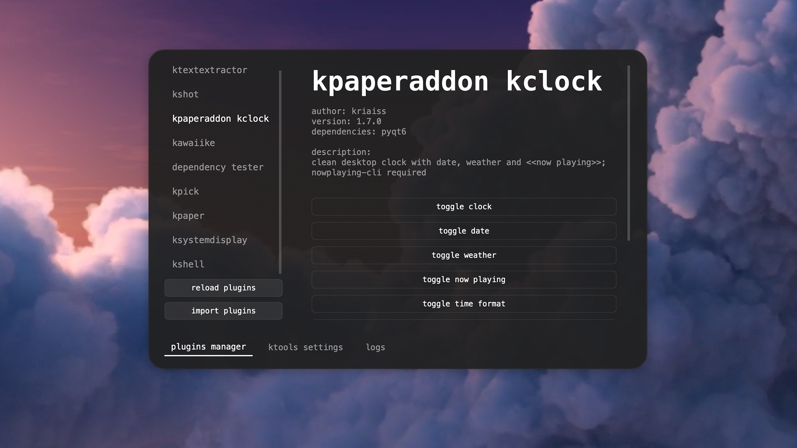
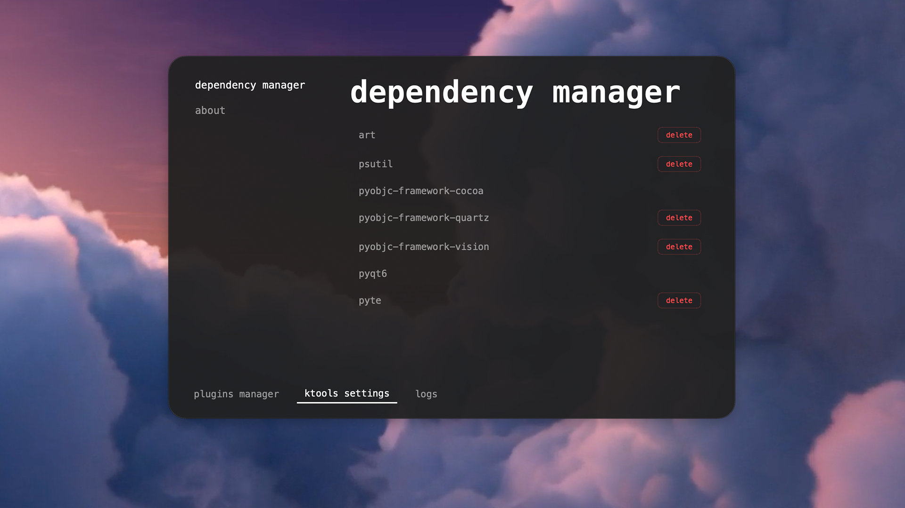
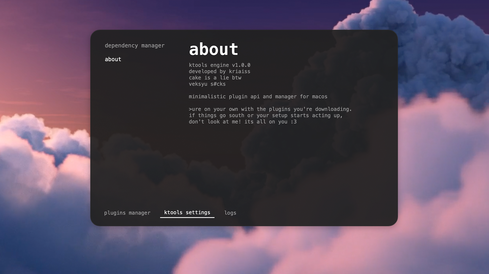
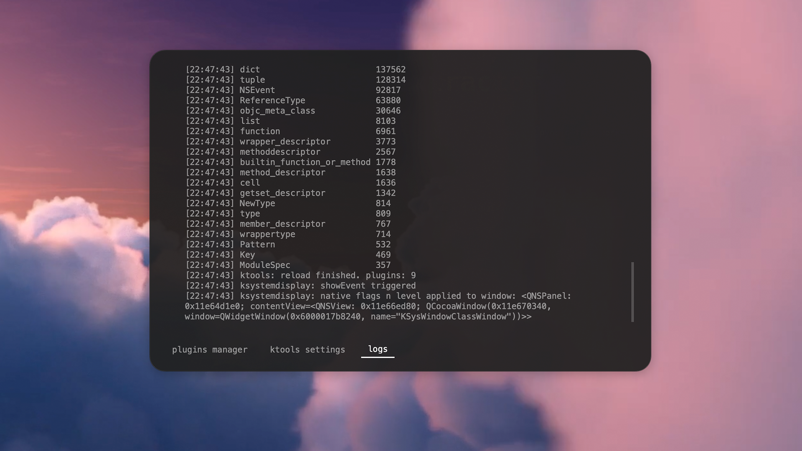

<div align="center">
    <pre>
    _  _______  _____  ____  _     ____
    | |/ /_   _|/ _  \|  _ \| |   / ___|
    | ' /  | | | | | || | | | |   \___ \
    | . \  | | | |_| || |_| | |___ ___) |
    |_|\_\ |_|  \_____/|____/|____|____/
    </pre>
</div>
<p align="center">
    minimalistic plugin engine for macos.
    keep ur workflow clean. manage ur tools. stay on style.
</p>
<p align="center">
    
    
</p>

⠀

# what is this?

ktools is a manager for macos that lets u run custom python plugins. it sits in ur menu bar and gives u a slick ui to control everything.


### features

* smooth ui: frameless windows with quint-easing animations and miku-like vibes.
* hot reload: change ur plugin code, hit reload, and see the magic happen instantly.
* auto deps: if ur plugin needs a library, ktools will try to pip install it for u.
* native integration: sits in ur menu bar, respects dark mode, and handles window focus like a pro.
* ktoast notifications: clean, stackable alerts at the bottom of ur screen.
* safe imports: import plugins via .zip files directly through the manager.

⠀

# how to use (for everyone)

### 1. startup

just run

```
python3 ktools.py
```

u’ll see a new icon in ur menu bar. thats ur hub. (recommended to use ktools in venv)

### 2. installing plugins

got a plugin zip?

* click the menu bar icon -> plugin manager.
* hit the import plugins button.
* select ur .zip file.
* ktools does everything else (extracting, loading, and even installing libraries if they r missing).

### 3. managing ur tools

the plugin manager window is ur command center (n it got some tabs):

* plugins manager: see what u got, check the info, configure plugin or delete it if u don't use it anymore.

* settings: dependency manager (check what extra libraries r taking up space) and ktools about (with easter eggs :3).


* logs: if something isn't working, check the logs tab. it tells u exactly whats happening under the hood.


⠀

# setup (first time)

u need a mac (ofc u need a mac for software that uses macos API) and python 3.12+.

```
""" install the basics """
pip3 install pyqt6 pyobjc objgraph

""" run the engine """
python3 ktools.py
```

### important:
#### it is highly recommended to use ktools in venv!

⠀

# the toolkit (for developers)

read this if u want to use all power of the ktools

⠀

### want to build ur own? its easy. drop a folder in /plugins with two files:

### 1. inf.json

tell the engine what ur deal is.

```python
{
    // ktools documentation handles these comments, but standard JSON doesn't. (maybe idk fr)
    "name": "plugin name",
    "author": "ur :3",
    "version": "1.0.0",
    "description": "short summary",
    "dependencies": ["requests"], // ktools will auto-install these via pip
    "settings": ["open menu"] // these become buttons in the ui
}
```

### 2. your_plugin.py

must have a Plugin class.

```python
class Plugin:
    def __init__(self, ktools):
        self.ktools = ktools

    """ this matches the name in inf.json (lowercase, spaces to underscores) """
    def open_menu(self):
        self.ktools.notify("opening ur custom menu...")

    def unload(self):
        """ cleanup code here """
        pass
```
⠀

### now ur plugin gets the ktools object in init. here is the api:

* ktools.notify("ur text") - spawns a clean ktoast notification at the bottom.
* ktools.request_show("ur plugin name") - hides other overlays and brings ur plugin to focus.
* ktools.restore_focus() - returns focus to the app u were using before.
* ktools.add_log("ur msg") - sends a message to the built-in log viewer.
* ktools.reload_all() - nukes the memory and reloads all plugins.
* self.layer = "ur type" - defines how ur window lives in the macos workspace.

⠀

## ktoast (ktools.notify("ur text"))

ktoast is the native-feeling notification system built into the engine. forget clunky native macos banners - these are slick, stackable, and styled to match ur workflow.


### about

* stacking logic: alerts don't overlap. they stack vertically from the bottom, pushing older notifications up.
* native behavior: uses NSStatusWindowLevel + 1 so they stay visible over full-screen apps without stealing keyboard focus.
* auto-cleanup: each toast lives for 3 seconds, then fades out and nukes itself from memory automatically.
* stay swag: everything is rendered in lowercase menlo with subtle transparency to keep the aesthetic consistent.

### usage

u don't need to touch the KToast class directly. just call it through the engine:

```python
"""simple notification"""
self.ktools.notify("ur text")
```

⠀

## focus control (ktools.request_show("ur plugin name") and ktools.restore_focus())

managing window focus on macos can be a nightmare, so ktools handles the heavy lifting for u. these two methods are the backbone of a smooth user experience.

### ktools.request_show("ur plugin name")

call this before u show ur plugin window. it tells the engine to prepare the workspace for ur tool.

* what it does: finds any other active overlay layer (below more) plugins and hides them instantly. it also sets an internal flag to prevent focus glitches during the transition.
* returns: a boolean. true if it had to close another plugin, false if the coast was already clear. (pro tip: use the return value to decide if u need a small delay (e.g., 100ms) before ur show animation to let the other window finish hiding.)

### ktools.restore_focus()

this is ur cleanup duty. call this after ur hide animation is finished.

* what it does: tells macos to give focus back to whatever app the user was using before they summoned ur plugin (browser, terminal, ide, etc.).
* why: without this, macos might keep the "focus" on a hidden python process, leaving the user clicking twice just to get back to their work.

### usage

```python
def toggle(self):
    if not self.isVisible():
        """ 1. clear the way """
        self.ktools.request_show("my_plugin")
        """ 2. show ur window """
        self.show_anim()
    else:
        """ 3. hide ur window """
        self.hide_anim()

def _on_hide_finished(self):
    self.hide()
    """ 4. give control back to the system """
    self.ktools.restore_focus()
```

staying respectful of the user's focus is what makes a plugin feel like a native utility rather than a buggy script.

⠀

## logs (ktools.add_log("ur msg"))
debugging on macos can be a pain when windows are floating everywhere. ktools includes a built-in log viewer so u don't have to babysit the terminal.

### ktools.add_log("ur msg")

this is ur primary tool for tracking what's happening under the hood.

* what it does: sends a string to the logs tab in the plugin manager.
* formatting: it automatically prepends a timestamp and handles line breaks.
* the capture: the engine also redirects standard print() calls to this log, but using add_log is the "official" way to ensure ur messages aren't lost in the shuffle.

### why u need to use it?

coz i said that.

but without jokes: i spent a month on this, if u don't use logs to fix ur bugs, i'll personally send a while True: pass to ur cpu.

* user-friendly debugging: if ur plugin fails to load a dependency or hits an api error, the user can check the logs tab and tell u exactly what went wrong.
* stay clean: keep ur production code quiet, but use logs to trace heavy logic or network requests.

### usage

```python
def load_data(self):
    self.ktools.add_log("fetching remote data...")
    try:
        """ ur logic here """
        self.ktools.add_log("data synced successfully.")
    except Exception as e:
        self.ktools.add_log(f"error: {str(e)}")
``` 

⠀

## plugins reload (ktools.reload_all())

understanding how plugins are born and killed is crucial for a stable setup. since ktools supports hot-reloading, u need to make sure ur plugin doesn't leave "ghost" processes or monitors behind.

### ktools.reload_all()

this is the nuclear option for when u change ur code or configs.

* what it does: it triggers the unload() method for every active plugin, clears them from memory, and then re-scans the /plugins folder to start everything fresh.
* when to use: call this if ur plugin just finished an update, imported new assets, or if u want to provide a "reset" button for the user.

### def unload(self)

this is the MOST IMPORTANT (!!!) method u will write. it’s the "last will and testament" of ur plugin.

* the rule: if u created it, u must kill it here.

what to clean up:

* timers: stop all QTimer instances.
* monitors: remove macos NSEvent monitors (global and local).
* widgets: call deleteLater() on all ur windows and frames.
* signals: disconnect any triggered.disconnect() slots from the tray menu.

### usage

```python
def unload(self):
    """ 1. stop the heartbeat """
    if hasattr(self, 'timer'):
        self.timer.stop()

    """ 2. release macos event taps """
    if self.global_monitor:
        NSEvent.removeMonitor_(self.global_monitor)

    """ 3. nuke the ui """
    if self.window:
        self.window.close()
        self.window.deleteLater()
    
    """ 4. forced garbage collection """
    import gc
    gc.collect()
    
    self.ktools.add_log(f"{self.name} unloaded cleanly.")
```

⠀

## the layers system

the self.layer attribute in ur Plugin class is the main way to tell the engine how to treat ur windows. it dictates how ur tool interacts with other plugins and the macos workspace.

### 1. overlay (default)

smart, context-aware windows designed for quick tools.

* how it works: the engine tracks these windows. if u open one overlay, the others are hidden to keep ur screen clean. they also close automatically if u click outside them (if implemented with WindowDeactivate logic).
* the vibe: use this for anything that isn't supposed to stay on screen forever.

### usage

```python
class Plugin:
    def __init__(self, ktools):
        """ there is ur layer setup """
        self.layer = "overlay"
```

### 2. fixed

persistent desktop widgets that ignore the "hide others" rule.
fixed layer is like that one friend who never leaves the party. use it wisely.

* how it works: these windows stay visible even when u summon an overlay. they are ignored by ktools.request_show().
* use this for monitors, dashboards, or "always-on" info panels.

### usage

```python
class Plugin:
    def __init__(self, ktools):
        """ there is ur layer setup """
        self.layer = "fixed"
```

### implementation tips

* for overlays: always call ktools.request_show(self.name) before ur show animation. it ensures the workspace is clear for ur plugin.
* for fixed: since these windows usually shouldn't steal focus, make sure to set the proper flags in ur QWidget (but not accessary):

```python
self.setWindowFlags(
    Qt.WindowType.FramelessWindowHint | 
    Qt.WindowType.WindowStaysOnTopHint | 
    Qt.WindowType.Tool |
    Qt.WindowType.WindowDoesNotAcceptFocus
)
```

by choosing the right layer, u ensure ur tool feels like a native part of the OS rather than a window that's constantly getting in the way.

⠀

# good manners (best practices)

to keep the ktools ecosystem smooth and beautiful, follow these etiquette rules. i'll use the kpick plugin as the reference for "doing it right."

### 1. respect the theme

ktools supports dark and light modes. don't hardcode colors. always pull the current macos theme from NSUserDefaults.

* the kpick way: it uses a helper function get_kpick_theme(is_dark) and updates the stylesheet dynamically when update_theme() is triggered by the engine.

```python
""" check for dark mode the native way """
is_dark = NSUserDefaults.standardUserDefaults().stringForKey_("AppleInterfaceStyle") == "Dark"
```

### 2. be a focus ninja

if ur plugin is an overlay, it should never stay open if it's not being used.

* the kpick way: it monitors WindowDeactivate events. if the user clicks another app, kpick automatically triggers its hide_anim().
* escape to close: always implement an eventFilter to catch the Esc key. users expect it.

### 3. no ghosting (clean unloads)

when ktools reloads, ur plugin must vanish completely. if u leave a "monitor" running, the next reload will have two monitors, then three, then ur mac crashes (and ur brain (so don't do like that (PLEASE (!!!)))).

* the kpick way: notice how unload() explicitly removes both global_monitor and local_monitor.

```python
def unload(self):
    """ cleanup """
    NSEvent.removeMonitor_(self.global_monitor)
    self.action.triggered.disconnect()
    self.shell.deleteLater()
```

### 4. smooth entries and exits

never just .show() or .hide() a window. it’s jarring. use QPropertyAnimation with the OutCubic or OutQuint easing curves.

* the kpick way: it calculates the center of the screen, starts the window slightly higher and at 0.0 opacity, then slides it down and fades it in simultaneously.

### 5. the native touch

use AppKit when python/qt isn't enough.

* the kpick way: instead of building a custom color picker, it calls the native macos sampler (NSColorSampler). it feels more premium and respects the os.

```python
""" calling the native mac eye-dropper """
sampler = NSColorSampler.alloc().init()
sampler.showSamplerWithSelectionHandler_(self.handle_native_color)
```

### 6. sample plugins

u can find the full source code for my sample plugins in my profile. it’s the best template for building overlays with hotkeys and animations.

⠀

# ure on ur own with the plugins u download. if things go south or ur setup starts acting up, don't look at me! its all on u :3

### final thoughts

i might have missed something. even though this is a full-blown api, i’m still just a human...

v1.0.1 is in the works to fix the lag and add more juice. until then, consider it a "cinematic experience" at 24 fps.

why is it slow? coz it's python. why am i still using it? coz i am sigma :3

maybe in the future, i’ll build a dedicated site with proper, high-end documentation for all my utilities. for now, we vibe here.

commits with bug fixes and optimizations are more than welcome. if u find a way to make it faster or cleaner, don't be shy - hit that pull request :3

it took 1 month to made this (include sample plugins)!

⠀

p.s. if u read all this, ur certified cool. 12/10 dev energy.

no macs were harmed in the making of this engine. my mental health is a different story though.

by kriaiss.

⠀

no, by a sigma 676767676767
