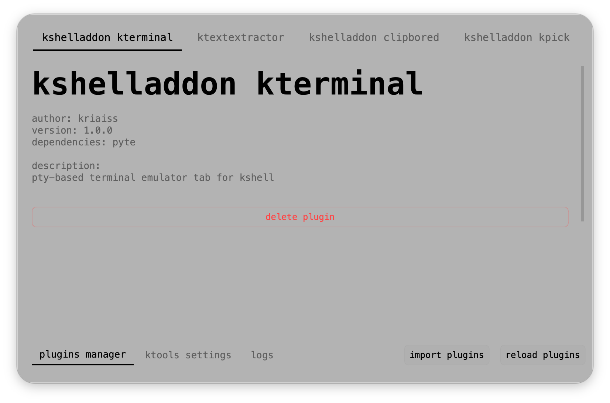
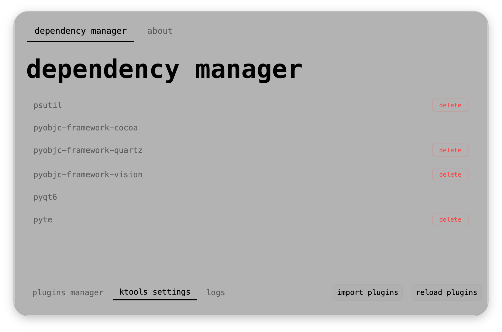
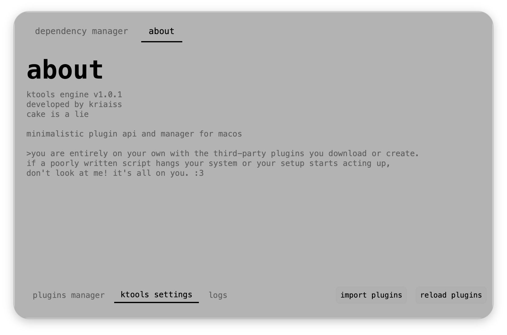
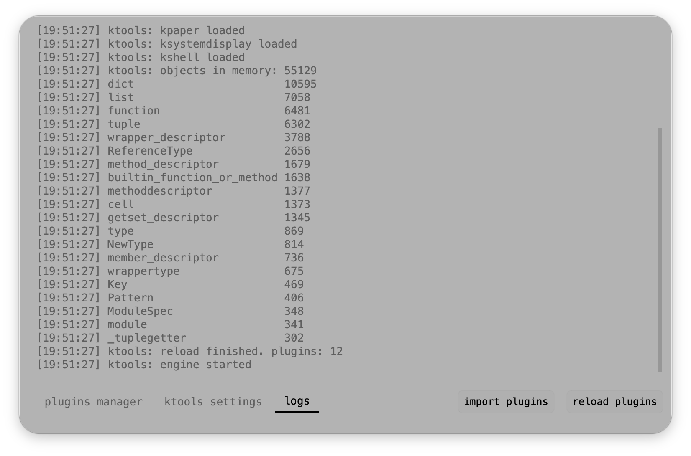

<div align="center">
    <pre>
     ____  __.___________________   ________  .____       _________
    |    |/ _|\__    ___/\_____  \  \_____  \ |    |     /   _____/
    |      <    |    |    /   |   \  /   |   \|    |     \_____  \ 
    |    |  \   |    |   /    |    \/    |    \    |___  /        \
    |____|__ \  |____|   \_______  /\_______  /_______ \/_______  /
            \/                   \/         \/        \/        \/
    </pre>
</div>
<p align="center">
    A minimalist, highly resilient plugin engine for macOS.
</p>
<p align="center">
    
    
</p>

⠀

## What is ktools?

`ktools` is a lightweight, dynamically loaded plugin manager and UI engine for macOS. Built on top of PyQt6 and PyObjC, it acts as a native bridge to macOS APIs, running custom Python tools from your menu bar without the usual boilerplate.

### Core Features
* **Isolated Crash Recovery**: A custom `sys.excepthook` intercepts Python exceptions inside plugins. If your plugin throws an error, `ktools` will safely unload it, show a toast notification, and keep the main app running. No more crashing the whole engine because of a typo.
* **Hot Reloading**: Edit your plugin code and hit reload to apply changes instantly.
* **Auto Dependencies**: Automatically runs asynchronous `pip install` for packages listed in your plugin's `inf.json`.
* **Native macOS Integration**: Respects Dark/Light mode, handles native window focus (even when macOS tries to break it), and injects `NSWindow` flags to keep overlays on all spaces.

⠀

## Screenshots section









⠀

## How to Use (For Users)

1. Clone the repo and navigate to it.
2. Create a virtual environment (`python3 -m venv .venv` and `source .venv/bin/activate`).
3. Run `python3 main.py`.
4. Click the menu bar icon -> **Plugin Manager** to import `.zip` plugins or reload existing ones.


⠀

## The Developer Handbook: Building Plugins

If you want to build a `ktools` plugin, you don't need to read the source code. Everything you need is right here. 

### 1. `inf.json` (The Manifest)

Every plugin lives in `plugins/your_plugin_name/` and must contain an `inf.json`. The engine reads this first to asynchronously install your dependencies before importing your Python code.

```json
{
    "name": "my_epic_plugin",
    "author": "you",
    "version": "1.0.0",
    "dependencies": ["requests", "psutil"],
    "settings": ["open custom menu", "clear cache"]
}
```
*Note: The strings in the `"settings"` array will automatically map to methods in your Python class where spaces are replaced with underscores. For example, `"open custom menu"` will trigger `self.open_custom_menu()` when the user clicks it in the UI.*

### 2. The Plugin Skeleton

Your main python file must have the same name as the folder (e.g., `my_epic_plugin.py`) and expose a `Plugin` class. 

```python
import os
import gc
from PyQt6.QtCore import QTimer
from PyQt6.QtWidgets import QWidget

class Plugin:
    def __init__(self, ktools):
        # 1. Store the ktools core instance
        self.ktools = ktools
        self.name = "my_epic_plugin"
        
        # Define your window layer:
        # "overlay" -> Behaves like a dashboard. Hides other overlays when opened.
        # "fixed"   -> For desktop widgets (like clocks). Stays visible permanently.
        self.layer = "overlay" 
        
        # 2. Config integration (optional)
        # If you define self.config_path and the file exists, ktools will automatically 
        # inject an "open config.json" button into the Plugin Manager UI for you.
        self.config_path = os.path.join(os.path.dirname(__file__), "config.json")
        
        self.widget = None
        
        # 3. Wait for the engine to fully wake up before registering
        QTimer.singleShot(200, self.register)

    def register(self):
        # Initialize your UI here
        self.widget = QWidget()
        
        # Apply native macOS flags to your window
        self.ktools.apply_global_native_flags(self.widget.window(), is_overlay=(self.layer == "overlay"))

    def get_actions(self):
        """ Return a list of QAction objects to inject into the macOS status bar menu. """
        return []

    def update_theme(self):
        """ Called automatically when macOS switches between Dark and Light mode. """
        pass

    def unload(self):
        """ 
        CRITICAL: Clean up everything! 
        Stop all QTimers, disconnect all PyObjC NSEvent monitors, and delete widgets. 
        """
        if self.widget:
            self.widget.deleteLater()
            self.widget = None
        
        # Force garbage collection to prevent memory leaks into the void
        gc.collect()
```

### 3. The Core API (`self.ktools`)

Your plugin is passed the main `ktools` instance. You have access to a very powerful toolkit:

#### `self.ktools.notify(message)`
Triggers a non-blocking `ktoast` (a sleek, animated popup on the screen) to notify the user of background events.

#### `self.ktools.toggle_plugin(plugin_id)`
Programmatically open or close another plugin's UI by its folder name (e.g., `self.ktools.toggle_plugin("kshell")`).

#### `self.ktools.refresh_menu()`
Forces the macOS status bar menu to rebuild. Call this if your plugin dynamically adds or removes `QAction` items at runtime.

#### `self.ktools.restore_focus()`
macOS focus management is notoriously broken when hiding frameless windows. If your plugin closes its UI, call this method. The engine will forcefully inject `NSApplicationActivateIgnoringOtherApps` to return keyboard focus to whatever app the user was previously using (like Safari or Xcode).

#### `self.ktools.apply_global_native_flags(window, retries=5, is_overlay=True)`
Call this on your `QWidget.window()` during initialization. It bypasses Qt and talks directly to `AppKit.NSWindow`. 
* If `is_overlay=True`, it ensures your window joins all macOS spaces (`NSWindowCollectionBehaviorCanJoinAllSpaces`) so it doesn't vanish when the user swipes desktops.
* If `is_overlay=False` (for `fixed` widgets like a desktop clock), it pushes the window to the desktop level and ignores mouse events.

#### Standard `print()` / Logging
You do not need to build your own logging system. `ktools` dynamically hijacks `sys.stdout`. Any standard `print("hello")` or error stack trace in your plugin will automatically be routed into the GUI "Logs" tab.

⠀

### 4. Golden Rules for Plugins

To keep the engine bulletproof, you must obey these rules:

1. **Do not block the main thread.** `ktools` runs on a single PyQt6 event loop. If you run `requests.get()` or `time.sleep()`, the entire macOS menu bar freezes. Use `QThread`, `QTimer`, or `subprocess` for heavy lifting.
2. **Handle your PyObjC Garbage.** If you instantiate native Objective-C objects (like `NSColorSampler` or `QImage` for the clipboard), keep a strong reference to them in Python (`self.my_obj = ...`). If the Python Garbage Collector nukes them before macOS is done reading them, your app will instantly die with a `SIGTRAP` segfault.
3. **Clean up in `unload()`.** When a user clicks "Reload Plugin", `ktools` dynamically drops your module and re-imports it. If you left global hotkey monitors (`NSEvent.addGlobalMonitor...`) or `QTimer`s running without disconnecting them in `unload()`, they will spawn duplicates, leading to astronomical CPU usage and eventual crashes.
4. **Respect the Theme.** macOS is beautiful, don't ruin it with hardcoded white backgrounds in Dark Mode. Implement the `update_theme()` method in your plugin to dynamically switch your UI colors when the user changes their system theme.
5. **Defer UI Registration.** In your `__init__`, do not instantly start building heavy UI or calling core `ktools` engine methods. The engine might still be waking up. Use `QTimer.singleShot(200, self.register)` to give it a 200ms head start.
6. **Throttle Event Floods.** If your plugin handles a high volume of data (like terminal `stdout` or mouse tracking), do not force Qt to re-render on every single event. Throttle your rendering loop to ~60fps using a `QTimer` (16ms), or you will lock up the entire interface.
7. **Lazy Import Heavy Frameworks.** Don't put `import AppKit` or `import Quartz` at the top of your script. It slows down the engine's boot time and can cause weird Objective-C runtime conflicts. Import them locally inside the functions that actually use them.
8. **Manage External Focus Stealing.** If your plugin spawns an external app (like `webbrowser.open()`), set `self.window().ktools.skip_focus_restore = True` right before doing so. Otherwise, `ktools` will violently steal focus back from the app you just tried to open.
9. **Use JSON for Configurations.** All configs, data caches, and local states should be stored as `.json` files inside your plugin's directory. This integrates flawlessly with `ktools`' built-in `open config.json` UI and keeps the architecture clean. No `.ini`, `.yaml`, or raw `.txt` files.
10. **Learn from the Masterpieces.** It is highly recommended to read the source code of the official plugins in my GitHub profile to truly grasp the API and architectural patterns. Also, while you aren't forced to, try to respect the overall minimalist UI design of `ktools` so your plugin doesn't look completely out of place.

⠀

> P.S. Here's your v1.0.1 now! Enjoy! (does this make sense to anyone?)

by kriaiss.